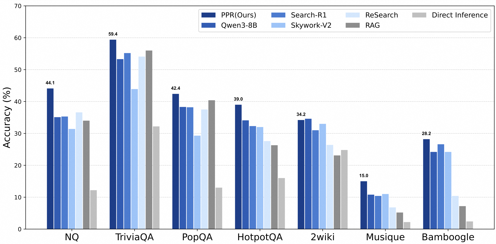
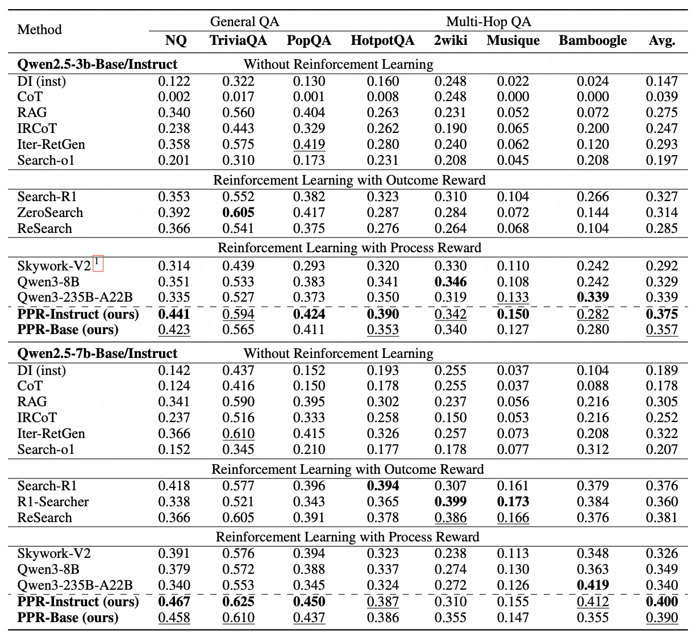
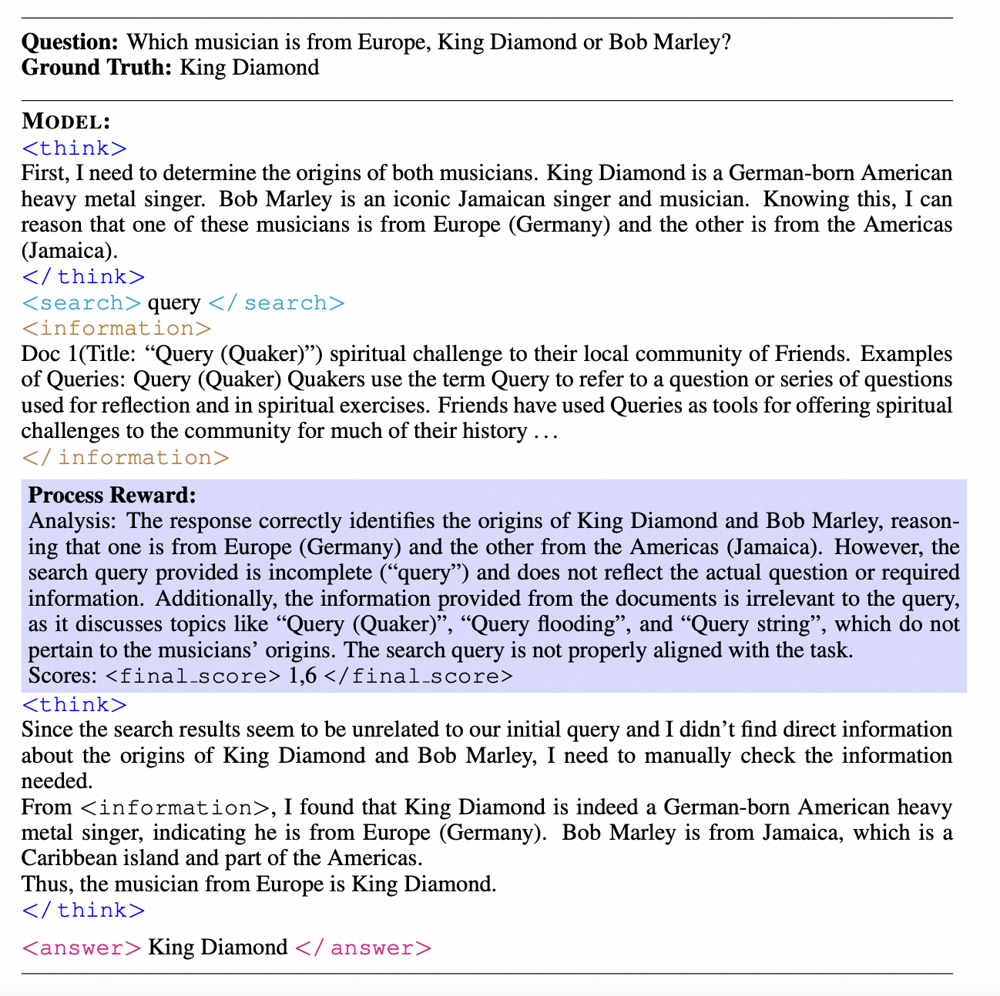

# PPR: Hybrid Reward Normalization for Process-supervised Non-verifiable Agentic Tasks

<p align="center">
  <a href="https://www.arxiv.org/abs/2509.25598">Paper</a> ｜ 
  <a href="https://huggingface.co/collections/peiranxu/ppr-collection-68daccbbca88f5ace244ae7f">Model</a>
</p>

## Overview
<p align="center">
  
</p>


**PPR** is a reinforcement learning framework that integrates principle-based process rewards and reward normalization to achieve stable and effective training of LLM agents in search task.

## Links

- [Installation](#installation)
- [Quick start](#quick-start)
- [Performance](#performance)
- [Ackowledge](#acknowledge)
- [Citations](#citations)

## Installation

#### Environment

```bash
conda create -n ppr python=3.10
conda activate ppr
pip install torch==2.4.0 --index-url https://download.pytorch.org/whl/cu121
pip install vllm==0.6.3

# verl
pip install -e .

# flash attention 2
pip3 install flash-attn --no-build-isolation
pip install wandb

# Local retriever env
pip install pyserini
pip install https://github.com/kyamagu/faiss-wheels/releases/download/v1.7.3/faiss_gpu-1.7.3-cp310-cp310-manylinux_2_17_x86_64.manylinux2014_x86_64.whl

# sglang for reward model serving
# We recommend create a new environment with torch>=2.6 to install sglang, as using current environment may have package conflicts.
pip install sglang[all]
```


## Quick start

Train a 3B search LLM with PPRM on NQ dataset with e5 as the retriever and wikipedia as the corpus.

(1) Download the indexing and corpus.
```bash
save_path=/the/path/to/save
python scripts/download_corpus.py --save_path $save_path
cat $save_path/part_* > $save_path/e5_Flat.index
gzip -d $save_path/wiki-18.jsonl.gz
```

(2) Process the NQ dataset.
```bash
python scripts/data_process.sh
```

(3) Download the process reward models (PPRMs).
```bash
# PPRM with 3B training data
huggingface-cli download --resume-download peiranxu/PPRM_3b_data --local-dir PPRM_3b_data
```

(3) Launch a local retrieval server.
```bash
bash retrieval_launch.sh
```

(4) Run RL training with PPRM with Qwen2.5-3B-Instruct.
```bash
conda activate PPR
bash examples/train_3b.sh
```

## Performance
#### Main Results
<p align="center">
  
</p>

#### Case Study
<p align="center">
  
</p>

## Acknowledge

The implementation of this project is built upon [veRL](https://github.com/volcengine/verl) [Search-R1](https://github.com/PeterGriffinJin/Search-R1/tree/main) and [RAGEN](https://github.com/ZihanWang314/RAGEN/tree/main). 
We deeply appreciate these teams for their contributions to open-source research and development.

## Citations
```bibtex
@article{xu2025hybrid,
  title={Hybrid Reward Normalization for Process-supervised Non-verifiable Agentic Tasks},
  author={Xu, Peiran and Li, Zhuohao and Xing, Xiaoying and Zhang, Guannan and Li, Debiao and Shi, Kunyu},
  journal={arXiv preprint arXiv:2509.25598},
  year={2025}
}
```